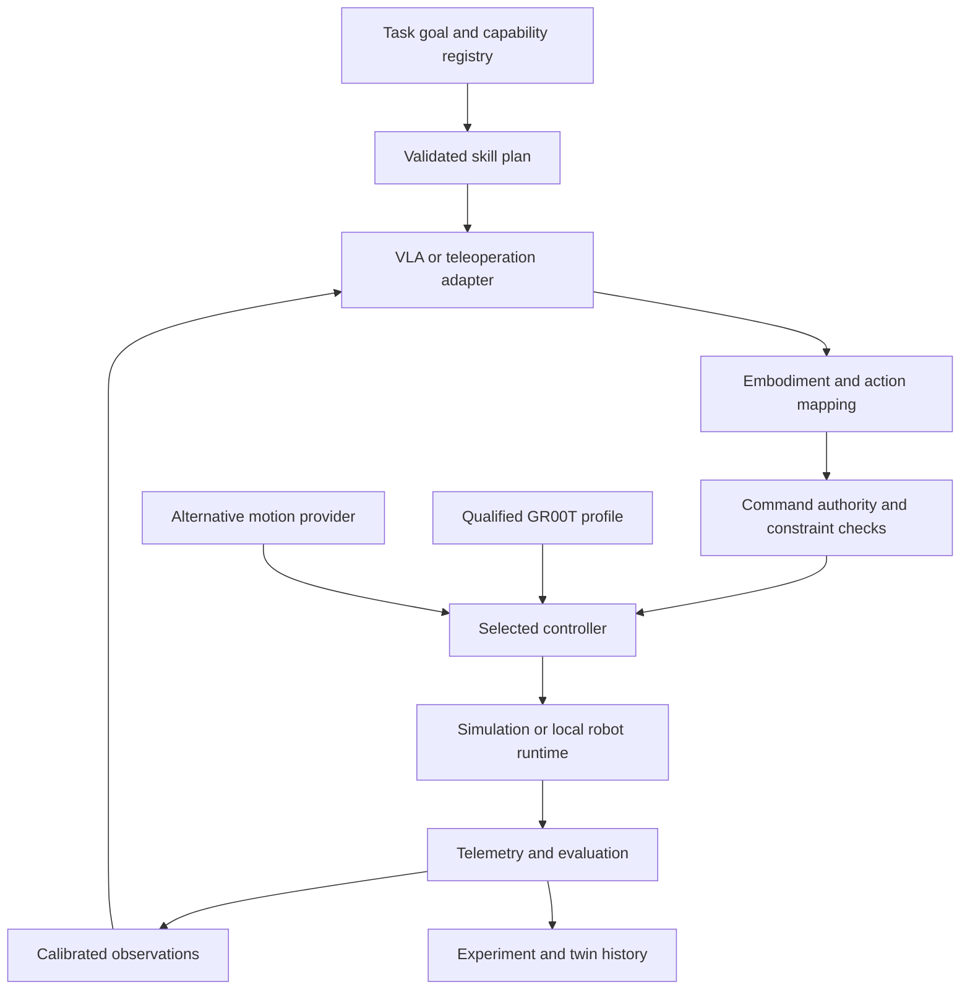
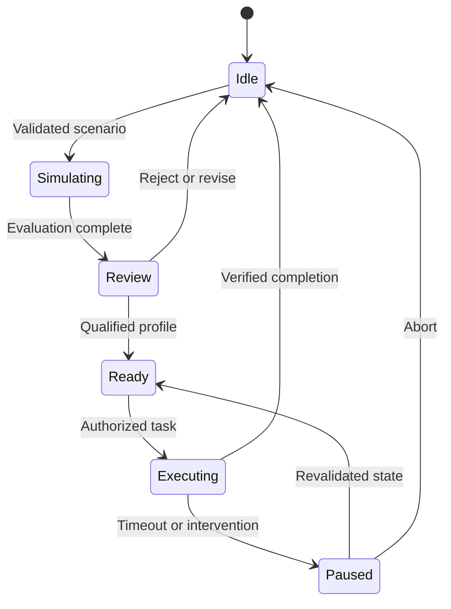
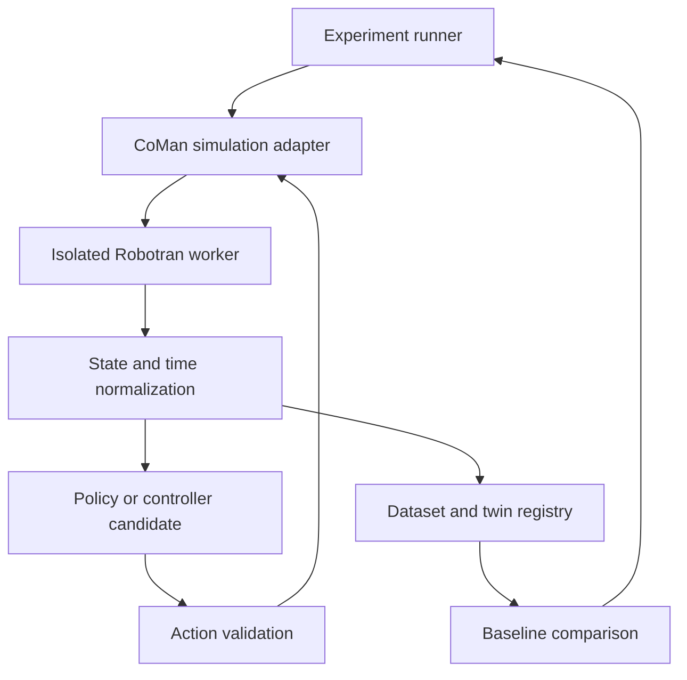

# JFXAI4MHERS — Open-Source AI Alternative Integration Architecture

## AI-Powered Humanoid Robotics Engineering, Simulation, Learning & Deployment Platform

> **Repository:** `robotics-intelligent-systems/jfxai4mhers`
>
> **Purpose:** reorganize the current humanoid-robotics software compendium into a modular, replaceable, open-source-first architecture for robot description, simulation, perception, motion control, dexterous manipulation, Vision-Language-Action models, task planning, teleoperation, learning, evaluation, digital twins and real-robot deployment.
>
> **Core principle:** JFXAI4MHERS should not become one monolithic simulator or one mandatory AI stack. It should expose canonical robot, task, skill, observation, action, dataset and simulation contracts so that hardware platforms, simulators, planners and AI models can be replaced independently.
>
> **Safety principle:** learned policies and LLM/VLA agents must not bypass deterministic low-level safety, collision checking, actuator limits, emergency stops, workspace restrictions or qualified human supervision.

---

> **Implementation status:** this repository contains architecture documentation and MBSE assets. The catalog expansion below is a proposal, not a running integrated stack. APIs, directory layouts, example metrics and deployment profiles are illustrative until implemented and tested. Source review: 2026-09-20.
>
> **Navigation:** [Categorized compendium](#7-categorized-compendium-and-integration-roles) · [GR00T integration](#79-gr00t-integration-architecture) · [Integration contracts](#710-cross-stack-integration-contracts) · [Delivery gates](#713-incremental-delivery-and-evidence) · [CoMan/Robotran](#714-comanrobotransimulator-integration-profile)

# 1. Source Project Direction

The current JFXAI4MHERS README describes an:

> **AI-Powered Humanoid Robotic Simulation Platform**

and references a broad ecosystem including:

- Berkeley Humanoid Lite;
- Asimov;
- RT Robot Arm Simulator;
- OpenVLA;
- Physical Intelligence `openpi`;
- CRAM;
- IAI Naive Kinematics;
- RoboKudo;
- ToddlerBot;
- open-source agile humanoid platforms;
- NEST;
- LLM-based multi-agent robot task planning;
- Giskardpy;
- DOGlove;
- RViz;
- human URDF models;
- NVIDIA Isaac Sim;
- OpenBCI;
- OpenExo;
- Multibody.jl;
- ALICE robotic exoskeleton;
- CoMan simulator;
- OpenArm;
- Open-TeleVision;
- ROBOTIS OpenMANIPULATOR;
- HHCM URDF/SRDF/ROS generation;
- Horizon trajectory optimization;
- BiDexHand;
- IR-SIM;
- TidyBot++.

The source repository also preserves the engineering lifecycle:

```text
MBSE
├── CAD
├── CAM
└── CAS
```

This proposal turns the catalog into an integrated architecture without assuming that every listed project is a mandatory runtime dependency.

---

# 2. Target Platform Vision

```text
REQUIREMENTS
    ↓
MBSE / ROBOT ARCHITECTURE
    ↓
ROBOT DESCRIPTION
    ↓
SIMULATION
    ↓
PERCEPTION + CONTROL + AI
    ↓
TASK / SKILL LEARNING
    ↓
EVALUATION
    ↓
SIM2REAL VALIDATION
    ↓
REAL ROBOT
    ↓
TELEMETRY / DATA
    ↓
MODEL + DIGITAL TWIN UPDATE
```

JFXAI4MHERS becomes a **robotics engineering control plane** rather than a single simulator.

---

# 3. High-Level Alternative Architecture

```text
┌──────────────────────────────────────────────────────────────────────┐
│                         JFXAI4MHERS                                  │
│ Requirements | MBSE | Robot Config | Experiments | Evaluation       │
└──────────────────────────────────┬───────────────────────────────────┘
                                   │
                                   ▼
┌──────────────────────────────────────────────────────────────────────┐
│                   ROBOTICS ORCHESTRATION LAYER                      │
│ Skill Registry | Task Graph | Experiment Runner | Policy Gateway    │
└───────────────┬─────────────────┬─────────────────┬─────────────────┘
                │                 │                 │
                ▼                 ▼                 ▼
       SIMULATION PLANE     EMBODIED AI PLANE   CONTROL PLANE
       MuJoCo / Gazebo      OpenVLA / openpi     ROS 2 / ros2_control
       optional adapters    local VLM/VLA        Giskard / MoveIt 2
                │                 │                 │
                └─────────────────┼─────────────────┘
                                  ▼
┌──────────────────────────────────────────────────────────────────────┐
│                     CANONICAL ROBOT BUS                             │
│ ROS 2 | Actions | Topics | Services | DDS/Zenoh | MCP | REST       │
└───────────────┬──────────────────┬─────────────────┬────────────────┘
                │                  │                 │
                ▼                  ▼                 ▼
        HUMANOID ROBOTS      DEXTEROUS ARMS      TELEOP / HAPTICS
        Berkeley Lite        OpenArm             Open-TeleVision
        ToddlerBot           OpenMANIPULATOR     DOGlove
        other adapters       BiDexHand           OpenXR / devices
                │                  │                 │
                └──────────────────┼─────────────────┘
                                   ▼
                           REAL-WORLD DATA
                                   │
                                   ▼
                       DATASET / MODEL REGISTRY
```

---

# 4. Architectural Layers

```text
Layer 1
Physical Hardware

Layer 2
Drivers / ros2_control

Layer 3
Robot Model / Kinematics / Dynamics

Layer 4
Simulation / Digital Twin

Layer 5
Motion / Manipulation / Locomotion

Layer 6
Perception

Layer 7
Learning / VLA / Policies

Layer 8
Task Planning / Cognitive Architecture

Layer 9
Human Interface / Teleoperation

Layer 10
Evaluation / Data / Governance
```

---

# 5. Open-Core Recommendation

Recommended open-source-first backbone:

```text
ROS 2
+
ros2_control
+
URDF / Xacro / SRDF
+
MuJoCo and/or Gazebo
+
MoveIt 2
+
Giskard / Pinocchio-style dynamics adapters
+
OpenCV / PCL / RoboKudo
+
OpenVLA / openpi provider interface
+
CRAM / Behavior-Tree-style task orchestration
+
PostgreSQL + object storage
+
MLflow / DVC-style experiment tracking
+
FastAPI
+
MCP Gateway
+
Docker / Kubernetes where useful
```

No single AI model or simulator should become mandatory.

---

# 6. Component Classification Strategy

Each compendium component should be classified as one of:

```text
CORE
Required platform capability

CORE CANDIDATE
Strong default implementation

OPTIONAL ADAPTER
Useful but replaceable integration

RESEARCH
Experimental / specialized

HARDWARE REFERENCE
Physical robot or device

EXTERNAL / LICENSE VERIFY
Useful integration requiring independent license review
```

---

# 7. Categorized Compendium and Integration Roles

This expanded catalog covers all 35 supplied entries. Links identify source projects, not implemented JFXAI4MHERS adapters. Roles below are proposed; releases, licenses, assets, APIs and hardware configurations require qualification.

## 7.1 Humanoid platforms and embodiment references

| Component and source | Proposed role | Qualification boundary |
|---|---|---|
| [HOPE Jr / HOPEJr](https://github.com/TheRobotStudio/HOPEJr) | DIY humanoid and dexterous-hand research; robot-description and teleoperation reference | Distinguish the full Humanoid and Arm/LeRobot tracks; verify hand revision, firmware, CAD rights and available control interfaces |
| [QingLoong / OpenLoong Hardware](https://github.com/loongOpen/OpenLoong-Hardware) | Full-size humanoid component architecture, mechanical assets and embodiment requirements | Hardware drawings do not establish a complete runnable controller; qualify software, model assets and licenses separately |
| [Berkeley Humanoid Lite](https://github.com/HybridRobotics/berkeley-humanoid-lite) | Humanoid description, simulation and learning profile | Code and non-code assets use different terms; validate the selected hardware/model revision |
| [Asimov](https://github.com/menloresearch/asimov-1) | Alternative buildable humanoid and embodiment adapter | Keep Asimov versions distinct; hardware and software licenses differ |
| [ToddlerBot](https://github.com/hshi74/toddlerbot) | Small humanoid for policy learning and loco-manipulation | MIT code does not remove the documented non-commercial restriction on design assets |
| [AGILOped](https://github.com/gficht/AGILOped_model) — Agile Open-Source Humanoid Robot for Research | Hardware, URDF, MuJoCo and STEP model reference | Asset availability is not evidence of integrated control, sensing or hardware availability |
| [WALK-MAN assets](https://github.com/ADVRHumanoids/iit-walkman-ros-pkg) | MBSE reference for future degraded-environment capabilities and requirements | Retain as a requirements/model reference; qualify legacy ROS/Gazebo assets before reuse |
| [Centauro model](https://github.com/ADVRHumanoids/centauro-simulator) | Later disaster-response asset/controller evaluation | Legacy ROS launch conventions need isolation or porting; physical hardware availability is not assumed |

Disaster-response references support civilian inspection, robustness and recovery scenarios. They do not imply that an open robot model is deployable in a hazardous environment or that a controller has been validated for that task.

## 7.2 Arms, dexterous hands and mobile manipulation

| Component and source | Proposed role | Qualification boundary |
|---|---|---|
| [OpenArm](https://github.com/enactic/openarm) | 7DOF arm and optional bimanual research cell | Select actual hardware, ROS 2 and simulation repositories; separate arm, gripper and cell capabilities |
| [ROBOTIS OpenMANIPULATOR](https://github.com/ROBOTIS-GIT/open_manipulator) | Official ROS 2 manipulation platform integration | Qualify the selected robot model, distribution, drivers and simulation assets |
| [BiDexHand](https://github.com/wengmister/BiDexHand) | Dexterous-hand hardware, calibration and pose/synergy adapter | Tendon/servo mapping, limits and sensing must match the specific revision; tactile sensing is not assumed |
| [TidyBot++](https://github.com/jimmyyhwu/tidybot2) | Holonomic mobile-manipulation and demonstration collection profile | Base, arm and camera interfaces remain separately qualified; mobile navigation does not validate full humanoid balance |

Hardware capability discovery must reflect actual sensors and command modes. Unsupported force, tactile, torque or Cartesian commands should be rejected rather than simulated as successful.

## 7.3 Embodied policies, whole-body control and cognition

| Component and source | Proposed role | Qualification boundary |
|---|---|---|
| [GR00T-WholeBodyControl — requested fork](https://github.com/sdk2035/GR00T-WholeBodyControl) / [upstream](https://github.com/NVlabs/GR00T-WholeBodyControl) | Optional whole-body controller provider: decoupled WBC, GEAR-SONIC and associated research workflows | Pin fork and upstream revisions; checkpoint, embodiment and observation configuration are coupled. Source and model-weight licenses differ |
| [OpenVLA](https://github.com/openvla/openvla) | Instruction-conditioned manipulation policy | MIT code and base-model-derived weight terms differ; action normalization must match the training embodiment/dataset |
| [openpi](https://github.com/Physical-Intelligence/openpi) | Alternative VLA training/inference provider | Pin model generation, checkpoint, runtime and action-chunk semantics; not a universal robot driver |
| [CRAM](https://github.com/cram2/cognitive_robot_abstract_machine) | Cognitive plans, task execution, semantic state and failure reasoning | Qualify the current monorepo separately from [legacy Common Lisp CRAM](https://github.com/cram2/cram); runtime and middleware support are version-specific |
| [SMART-LLM](https://github.com/SMARTlab-Purdue/SMART-LLM) — Smart Multi-Agent Robot Task Planning using LLMs | Research baseline for decomposition, coalition formation and task allocation | A plan must pass capability/resource checks; swapping a hosted LLM for a local model requires new evaluation |
| [NEST](https://github.com/nest/nest-simulator) | Spiking-neural-network research sandbox | A neural simulator, not a rigid-body simulator or default real-time motor controller |

Policy inference, task planning and controller execution are different services. A model producing a plausible action does not establish physical feasibility, correct task completion or an authorized command.

## 7.4 Motion, kinematics and description generation

| Component and source | Proposed role | Qualification boundary |
|---|---|---|
| [Giskardpy](https://github.com/SemRoCo/giskardpy) / [current monorepo location](https://github.com/cram2/cognitive_robot_abstract_machine/tree/main/giskardpy) | Constraint/optimization-based motion control | Qualify solver dependencies and ROS integration branch; mobile-manipulator control does not automatically provide free-standing biped balance |
| [Horizon](https://github.com/ADVRHumanoids/Horizon) | CasADi-based trajectory optimization and optimal control | Verify CasADi build, dynamics model, constraints, solver and timing; do not assume hard real-time feasibility |
| [IAI Naive Kinematics](https://github.com/code-iai/iai_naive_kinematics_sim) | Lightweight kinematics experimentation | Reviewed instructions target ROS Melodic/Noetic; kinematic feasibility is not dynamic stability or contact validation |
| [Modular HHCM](https://github.com/ADVRHumanoids/modular_hhcm) | Generate URDF, SRDF and robot packages from modular configuration | Verify generated package/middleware target; a ROS 2 exporter is a qualification or implementation task, not an assumed feature |

Description conversion must compare joint axes, origins, inertias, masses, limits, transmissions, collision geometry and actuator semantics. Similar rendered geometry is insufficient evidence of dynamics equivalence.

## 7.5 Perception, visualization and human representations

| Component and source | Proposed role | Qualification boundary |
|---|---|---|
| [RoboKudo](https://robokudo.ai.uni-bremen.de/) | Behavior-tree-based manipulation perception pipelines | Qualify ROS 1/ROS 2 installation and annotators; export timestamped hypotheses with calibration and provenance |
| [RViz / RViz2](https://github.com/ros2/rviz) | Robot state, TF, scene and trajectory inspection | Visualization only; an RViz display is not physics validation |
| [Human URDF models](https://github.com/gbionics/human-gazebo) | HRI, proximity and reachability experiments | Rigid-body human models are not clinically validated biomechanics; source motion-capture tooling and meshes have separate dependencies/terms |

Preserve sensor timestamps, frame transforms, calibration versions and observation quality. Perception outputs are estimates; label them accordingly instead of promoting every detection to ground truth.

## 7.6 Simulation and scientific dynamics

| Component and source | Proposed role | Qualification boundary |
|---|---|---|
| [RT Robot Arm Simulator](https://github.com/Nobu19800/RobotArmSimulatorRTC) | Legacy OpenRTM arm-component simulation reference | The inspected component specification references OpenRTM-aist; ROS 2 support and hard real-time execution are not established |
| [NVIDIA Isaac Sim](https://github.com/isaac-sim/IsaacSim) | Optional Omniverse-based simulation and sensor-learning profile | Repository code is Apache-2.0; [additional required components and assets have other terms](https://github.com/isaac-sim/IsaacSim/blob/main/LICENSE) |
| [Multibody.jl](https://github.com/JuliaComputing/Multibody.jl) | Optional JuliaSim scientific multibody analysis | [License](https://github.com/JuliaComputing/Multibody.jl/blob/main/LICENSE) declares commercial JuliaHub terms with non-commercial academic use; not a mandatory free-software dependency |
| [CoManRobotranSimulator — requested repository](https://github.com/sdk2035/CoManRobotranSimulator) / [origin named in its README](https://github.com/HDallali/CoManRobotranSimulator) / [separate CoMan reference](https://github.com/TimotheeHabra/coman_robotran) | Optional research adapter for CoMan multibody dynamics and controller comparison; see [integration profile](#714-comanrobotransimulator-integration-profile) | Qualify Robotran, the standalone C/C++ build and optional YARP interface. Keep repository lineages and model revisions distinct; ROS 2, learning APIs and real-time guarantees are not established |
| [IR-SIM](https://github.com/hanruihua/ir-sim) | Lightweight navigation, control and planning experiments | Not a replacement for validated whole-body contact dynamics |

MuJoCo/Gazebo remain the existing simulator-neutral baseline candidates. Specialized models should exchange scenarios and results through adapters; their internal states and solvers need not be interchangeable.

## 7.7 Teleoperation and demonstration collection

| Component and source | Proposed role | Qualification boundary |
|---|---|---|
| [DOGlove](https://github.com/TEA-Lab/DOGlove) | Dexterous input and haptic-feedback research | Calibrate hand mapping, input range, feedback limits and disconnect behavior |
| [Open-TeleVision](https://github.com/OpenTeleVision/TeleVision) | Immersive visual feedback and remote demonstration collection | Qualify headset/browser, camera pipeline, retargeting and end-to-end latency |

Teleoperation requires exclusive command authority, operator enable/disable semantics and timeout handling. Haptic feedback and visual rendering must not prevent the local controller from maintaining its independent limits.

## 7.8 BCI, wearable robotics and human-assistance research

| Component and source | Proposed role | Qualification boundary |
|---|---|---|
| [OpenBCI](https://github.com/OpenBCI/OpenBCI_GUI) | Recorded biosignal analysis and optional intent-classification research | Start with replay/simulation; a classification is not authorization for direct actuator control |
| [OpenExo](https://github.com/naubiomech/OpenExo) | Wearable robot architecture, instrumentation and control research | Hardware/firmware-specific qualification and separate human-subject evaluation are required |
| [ALICE](https://github.com/GuillermoHra/ALICE-OpenSource-Robotic-Exoskeleton) | Pediatric exoskeleton design and simulation reference | Catalog inclusion is not clinical validation, a treatment recommendation or permission for human deployment |

BCI and wearable profiles are separate from the general humanoid MVP. Human recordings require consent and appropriate access/retention controls; use synthetic or authorized recorded inputs for initial experiments.

## 7.9 GR00T Integration Architecture

GR00T-WholeBodyControl is a specialized controller integration, not the common interface for every robot. The reviewed fork describes decoupled lower-body RL/upper-body IK and GEAR-SONIC controller families. Its released SONIC model card is centered on Unitree G1 checkpoints; this does not establish compatibility with HOPE Jr, QingLoong, Berkeley Lite, Asimov or ToddlerBot.



Select exactly one active owner for each controlled joint group. GR00T, Giskardpy, Horizon-derived trajectories and teleoperation must not concurrently write incompatible commands to the same actuators.

### Controller profile contract

| Field | Required meaning |
|---|---|
| Embodiment | Robot description hash, hardware revision, joint names/order, sign conventions and actuator types |
| Controller family | Decoupled WBC, SONIC or another provider; no implicit substitution |
| Model bundle | Compatible encoder/decoder/checkpoint, observation configuration and checksums |
| Observation contract | Proprioception, reference representation, history/lookahead, normalization and timestamps |
| Action contract | Position/velocity/torque or latent/reference semantics, frames, units, scale and bounds |
| Timing | Inference period, robot-loop period, deadline, buffering and stale-input policy |
| Runtime | Training, simulation and deployment environments with pinned dependencies |
| Calibration | Joint offsets, base orientation, cameras, hands and gains/configuration revision |
| Qualification | Allowed tasks and simulator, regression evidence and explicitly approved deployment profile |

For the reviewed SONIC release, encoder, decoder and observation configuration must be used as a matching bundle. Its model card distinguishes reference lookahead variants. A lower-lookahead model is not automatically compatible with another checkpoint's preprocessing.

The fork documents Isaac Lab for training and a separate MuJoCo simulation environment, plus a C++/TensorRT deployment stack. Preserve these distinct profiles rather than describing all workflows as independent of NVIDIA components. Checkpoint weights use NVIDIA Open Model License terms separately from Apache-2.0 source code.

### New-embodiment admission

1. Acquire and qualify the robot description, inertial model, limits, actuators and available observations.
2. Define exact mappings between dataset/model joints and the target robot, including base frames and orientation conventions.
3. Identify unsupported observation/action channels; do not fill critical missing signals with fabricated values.
4. Establish a deterministic controller baseline and replay recorded observations without physical actuation.
5. Retarget demonstrations and retrain/fine-tune where necessary; validate dynamics and contact behavior in the selected simulator.
6. Measure tracking errors, failure cases, timing and saturation, including stale input and disconnect scenarios.
7. Consider a separately reviewed hardware evaluation only after simulation and interface gates pass.

There is no claim that a G1 policy can be transferred by renaming joints or rescaling a URDF. Hardware acquisition, balance control and real-world operation remain separate engineering work.

## 7.10 Cross-Stack Integration Contracts

| Boundary | Proposed contract | Verification |
|---|---|---|
| Description → simulation | Versioned model, joints, inertias, collision shapes and actuator mapping | Kinematic round trips, limits and physical parameter checks |
| Perception → world model | Timestamped object hypotheses, frame, covariance/quality and source | Transform age, calibration and object-identity consistency |
| Planner → skill runtime | Preconditions, resources, expected outcomes and cancellation | Capability checks, task ownership and bounded recovery |
| VLA → action mapper | Named action space, units, normalization, chunk length and rate | Dataset/embodiment match; reject unknown modes |
| Teleoperation → controller | Operator session, authority lease, mapped targets and expiry | Exclusive ownership and disconnect behavior |
| Controller → runtime | Validated joint/trajectory commands and deadline | Local watchdog, limits and stale-command rejection |
| Runtime → twin | Measured state, contacts, execution receipts and diagnostic events | Separate commanded, estimated, simulated and measured values |
| Evaluation → model registry | Scenario, seed, artifacts, metrics and failure evidence | Reproducibility and version-bound approval |

The ROS 2 control plane, event/API plane and AI/MCP plane are distinct. Legacy ROS 1/OpenRTM assets need isolated adapters or deliberate ports; containerization does not make their messages, controllers or dependencies ROS 2-compatible.

A middleware bridge is a proposed engineering component, not an implied solution to incompatible timing or semantics. Pin ROS distribution, message definitions, QoS and simulator interfaces. Keep hard real-time control outside HTTP/MCP and general-purpose model inference.

## 7.11 Open AI, RAG and Digital-Twin Extension

A local robotics assistant can retrieve approved manuals, robot descriptions, controller documentation and prior experiment evidence. It may propose typed task graphs, explain failures or prepare simulation configurations. Its suggestions remain distinct from approved execution.

| AI function | Output | Evaluation |
|---|---|---|
| RAG engineering assistant | Source-cited explanation/configuration draft | Citation accuracy, correct version and unsupported-answer handling |
| LLM task planner | Typed skill graph with resource assignments | Schema validity, preconditions, deadlocks and deterministic baseline comparison |
| VLA policy | Embodiment-specific actions or action chunks | Held-out tasks/scenes, action semantics and inference latency |
| Whole-body policy | Qualified motion references/control output | Tracking, contact/balance behavior, saturation and recovery evidence |
| Perception | Scene hypotheses with provenance | Calibration, detection errors, latency and out-of-domain inputs |
| Experiment analysis | Comparison of logged runs | Reproducible metrics; no invented hardware or task outcomes |

A proposed MCP gateway may expose read-only robot/twin queries, scenario validation, simulation launches and result comparisons. Write-capable task proposals require scope and authorization. No raw actuator writes or disable-interlock functions are exposed to a general assistant.

The twin stores geometry, calibration, software/firmware, controller configuration, measured state and health history. Simulated branches and model predictions retain separate provenance. Updating a model checkpoint does not silently replace an approved controller configuration.

An episode manifest should include robot/model hashes, sensor calibration, synchronized observations, action representation, task/scene version, controller mode, operator/source identity where authorized, interventions and outcome. Split training and evaluation by task/scene/operator or hardware condition as appropriate to avoid demonstration leakage.

### Authority state model



This is a proposed application lifecycle, not a safety-certified state machine. Local robot protection remains independent of application state.

## 7.12 License, Dependency and Maturity Gates

An open repository does not imply uniform rights to code, trained weights, datasets, CAD, meshes, simulator assets or a complete runtime.

| Finding from reviewed sources | Architectural consequence |
|---|---|
| GR00T source and weights use separate licenses | Track both in the controller manifest; do not label all artifacts Apache-2.0 |
| Isaac Sim source is Apache-2.0 but requires additional separately licensed components | Optional ecosystem profile; do not claim the entire dependency chain is free software |
| Multibody.jl declares commercial JuliaSim terms | External/restricted-license scientific adapter, excluded from a strict free-software baseline |
| ToddlerBot design assets are CC BY-NC-SA while code is MIT | Separate software experiments from hardware-design redistribution/commercial use |
| OpenVLA pretrained models inherit base-model terms | Weight qualification is independent of the source-code license |
| Giskardpy moved into the CRAM monorepo | Pin the chosen implementation and solver/ROS integration, rather than relying on an old import path |
| Naive Kinematics and Centauro assets show legacy ROS workflows | Replay/porting profiles until modern middleware integration is tested |
| The requested CoManRobotranSimulator documents Robotran installation and a standalone build with optional YARP; other CoMan references have different workflows | Qualify this repository independently, including Robotran terms, generated code, model assets and enabled dependencies; do not infer a fully free runtime or a MATLAB requirement from another repository |

Admission stages: **cataloged → source/license qualified → model/interface validated → simulation evaluated → hardware evaluation authorized and completed**. No component advances solely because it appears in this README.

## 7.13 Incremental Delivery and Evidence

| Phase | Scope | Required result |
|---|---|---|
| A. Description baseline | One arm or humanoid, one simulator, visualization | Consistent joint/frame mapping, reset/replay and versioned model |
| B. Deterministic skills | One motion provider and simple task | Constraints, timeout/cancel behavior and reproducible completion |
| C. Perception and teleoperation | One camera pipeline and one demonstration path | Calibration, synchronization and exclusive command authority |
| D. VLA comparison | OpenVLA or openpi against a baseline | Held-out task results, latency and invalid-action handling |
| E. GR00T research | Matching upstream embodiment/checkpoint in simulation | Bundle compatibility, reference tracking and failure analysis |
| F. Alternative embodiments | HOPE Jr, QingLoong, Asimov, AGILOped or another qualified model | Explicit adaptation effort and per-robot evidence |
| G. Advanced references | WALK-MAN/Centauro MBSE; NEST/BCI/exoskeleton research | Separate domain scope and evaluation plan |

Begin with one coherent profile, not the entire earlier “production recommendation” as a mandatory installation list. Infrastructure, simulator and model choices remain replaceable.

Documentation checks for this change cover all 35 supplied entries, source links, new Markdown fences and preservation of the existing engineering sections. No simulator build, training run, real-time benchmark, hardware trial or clinical evaluation has been performed.

---

## 7.14 CoManRobotranSimulator Integration Profile

**Category:** simulation, multibody dynamics and digital-twin research. **Classification:** OPTIONAL ADAPTER / RESEARCH, with dependency and license qualification before distribution. **Status:** proposed integration only; no simulator build or adapter execution has been performed.

### Source identity and observed build boundary

The requested [sdk2035/CoManRobotranSimulator](https://github.com/sdk2035/CoManRobotranSimulator) describes a simulator for the CoMan humanoid developed as part of the WALK-MAN European project. Its [README](https://github.com/sdk2035/CoManRobotranSimulator/blob/master/README.md) points to [HDallali/CoManRobotranSimulator](https://github.com/HDallali/CoManRobotranSimulator) in the clone instructions and requires Robotran installation. Retain both source identities and pin the exact revision used; the separate TimotheeHabra CoMan reference is not assumed to be identical.

The reviewed [Standalone/CMakeLists.txt](https://github.com/sdk2035/CoManRobotranSimulator/blob/master/Standalone/CMakeLists.txt) contains:

- C/C++ build configuration and a required Libxml2 dependency.
- An optional `FLAG_YARP` interface, disabled by default; enabling it selects C++ and requires YARP.
- Optional SDL, JNI/Java 3D, Simbody and visualization paths, controlled by build flags.
- A `FLAG_REAL_TIME` mode; this name does not establish measured timing or hard real-time performance.
- Legacy CMake settings and an optional compiler-selection branch naming GCC 4.4; current compiler compatibility must be tested rather than assumed.

The README also specifies `YARP_ROBOT_NAME=CoMan` and a build-specific `YARP_DATA_DIRS` location. Record these in the runtime profile when that interface is enabled. Do not treat these setup instructions as a ROS 2 bridge or as proof of a complete learning environment.

### Proposed adapter architecture



Start with an isolated standalone process and offline result ingestion. Introduce a YARP bridge only after its actual messages, units and control modes have been inspected. A later ROS 2 adapter is a separate implementation task. Keep simulation stepping inside the qualified worker rather than routing a timing-critical loop through MCP, HTTP or an enterprise event bus.

| Contract | Proposed CoMan mapping | Qualification evidence |
|---|---|---|
| Robot identity | Source commit, Robotran/model revision, model hashes, joint names and ordering | Configuration manifest and reproducible model load |
| State | Joint position/velocity and any available base or contact outputs | Explicit SI units, coordinate frames, timestamps and signal availability; do not synthesize undocumented sensor outputs |
| Action | Only control modes actually exposed by the selected build | Joint mapping, limits, sign conventions, saturation and rejected-command handling |
| Simulation lifecycle | Load, initialize, advance, stop and reset/restart | Deterministic initial conditions and documented time-step semantics; emulate reset through process restart if needed |
| Contact and dynamics | Selected ground-contact model or optional Simbody path | Record build flags, contact parameters, masses, inertias and solver settings |
| Results | State trajectories, control histories, available contacts, runtime and failures | Versioned artifacts, scenario IDs, seeds where applicable and artifact hashes |

Any URDF/MJCF conversion requires a documented transformation and numerical comparison; visual resemblance does not establish equal dynamics. Unsupported state-setting, batch stepping or observations must be advertised as unavailable rather than implemented with silent approximations.

### AI and digital-twin research roles

- **Controller evaluation:** compare a deterministic baseline with a learned controller on the same qualified CoMan model and scenario. Candidate measures include trajectory error, falls, constraint violations and computation time; define thresholds before acceptance.
- **Policy learning:** export validated observation/action trajectories for offline learning. Reinforcement-learning reset/step/reward/termination wrappers are future work, not existing simulator capabilities.
- **GR00T and VLA boundary:** reuse the controller and embodiment contracts in sections 7.9–7.10. A GR00T checkpoint, OpenVLA model or openpi policy must not be presumed compatible with CoMan joint layouts, sensors or action semantics.
- **Digital-twin calibration:** compare model trajectories against independent reference or measured data when available. Separate calibration data from validation data and record parameter uncertainty.
- **AI assistance:** use documentation retrieval and experiment summaries to support engineers. AI suggestions cannot replace the dynamics model, numerical checks or command validation.

### Delivery and evidence gates

| Gate | Work | Acceptance evidence |
|---|---|---|
| C0 — Provenance and terms | Pin requested repository and origin, inspect code/model licenses and Robotran/dependency terms | Reviewed dependency manifest; unresolved rights block redistribution |
| C1 — Reproducible standalone build | Select compiler, build flags and minimal dependencies; retain logs | Repeatable build and a documented reference run; not presumed container-ready |
| C2 — Model and interface qualification | Map joints, frames, units, initial state and control modes | Baseline replay, reset/restart behavior and numerical checks with agreed tolerances |
| C3 — Simulator-neutral adapter | Implement supported lifecycle and telemetry contracts | Invalid-command, timeout, cancellation and artifact tests |
| C4 — AI comparison | Add one candidate controller or offline learner | Held-out scenarios and comparison with the deterministic baseline |
| C5 — Twin update | Correlate against independent data and assess uncertainty | Traceable parameter update and regression results; no automatic hardware deployment |

Proposed artifacts may live under `simulation/coman_robotran/`, `docs/simulation/coman_robotran.md` and `evaluation/coman_robotran/`. These paths are a roadmap, not files created by this documentation change. Link requirements and evidence to **MBSE → CAD → CAM → CAS**, with simulator experiments and validation reports in the CAS scope.

**Source review:** 2026-09-22, based on the requested repository README and standalone build configuration. License clearance, compilation, physics validation, ROS 2 bridging and policy compatibility remain pending.

---

# 8. Robot Platform Abstraction

All robot platforms should implement a shared adapter:

```text
RobotProvider
├── get_description()
├── get_joint_state()
├── command_joint_targets()
├── command_cartesian_target()
├── get_sensors()
├── emergency_stop()
├── get_capabilities()
└── get_limits()
```

This prevents AI logic from depending directly on one robot vendor.

---

# 9. Canonical Robot Descriptor

```yaml
robot:
  id: berkeley_lite_01
  family: humanoid
  description:
    urdf: robots/berkeley_lite/robot.urdf
    srdf: robots/berkeley_lite/robot.srdf
    mjcf: robots/berkeley_lite/robot.xml
  capabilities:
    - locomotion
    - manipulation
  interfaces:
    middleware: ros2
    control: ros2_control
  limits:
    source: hardware_definition
```

---

# 10. Robot Description Layer

Recommended canonical formats:

```text
URDF / Xacro
→ ROS-centric description

SRDF
→ semantic planning groups

MJCF
→ MuJoCo simulation

SDF
→ Gazebo simulation

Mesh formats
→ STL / OBJ / glTF as appropriate
```

USD can remain behind an optional simulator adapter rather than becoming the canonical source.

---

# 11. Robot Description Single Source of Truth

Preferred flow:

```text
CAD / Configuration
       ↓
Canonical Robot Parameters
       ↓
Description Generator
       ├── URDF / Xacro
       ├── SRDF
       ├── MJCF
       └── SDF
       ↓
Validation
```

This replaces manually diverging model definitions.

---

# 12. HHCM-Style Generator Role

The HHCM concept can be generalized into the following target design. Generated ROS 2 packages and extra export formats are proposed extensions unless supported by the qualified upstream release:

```text
Robot Configuration
       ↓
Description Generator
       ↓
URDF
SRDF
ROS 2 Package
Simulation Assets
Control Config
```

JFXAI4MHERS should expose this as a generator plugin.

---

# 13. Simulation Core

For an open-source-first baseline:

```text
Primary:
MuJoCo

Secondary:
Gazebo

Optional:
IR-SIM
Multibody.jl
CoManRobotranSimulator (qualified optional research adapter)

External adapter:
Isaac Sim / Isaac Lab
```

The orchestration API must remain simulator-neutral.

---

# 14. Canonical Simulation Interface

```text
SimulationProvider
├── load_robot()
├── load_world()
├── reset()
├── step()
├── set_state()
├── get_state()
├── apply_action()
├── get_observation()
├── record()
└── close()
```

---

# 15. Simulation Run Contract

```yaml
simulation_run:
  id: sim_0001
  simulator: mujoco
  robot: toddlerbot_v1
  task: assembly_insert_connector
  seed: 42
  timestep: 0.002
  policy:
    provider: openvla
    version: experiment_17
  metrics:
    - success_rate
    - completion_time
    - contact_force
```

---

# 16. Simulator-Neutral Task Definition

```yaml
task:
  id: pick_insert_fastener
  scene: assembly_cell_A
  preconditions:
    - part_visible
    - tool_available
  goal:
    object: fastener_03
    target: fixture_socket_02
  constraints:
    max_force: configured
    collision_free: true
```

The task should not encode MuJoCo- or Isaac-specific APIs.

---

# 17. Physics & Dynamics Layer

Recommended open interfaces:

```text
Forward Kinematics
Inverse Kinematics
Forward Dynamics
Inverse Dynamics
Contact
Collision
Jacobian
Centroidal Dynamics
```

Possible implementations:

- Giskard-based kinematics/control;
- MuJoCo dynamics;
- Pinocchio-compatible adapter;
- CasADi/Horizon optimization;
- Multibody.jl optional adapter.

---

# 18. Whole-Body Motion Control

```text
Task Goal
   ↓
Whole-Body Controller
   ↓
Constraints
   ├── joint limits
   ├── collision
   ├── balance
   ├── contact
   └── workspace
   ↓
Joint / Torque Targets
```

Giskardpy is a candidate for constraint-based motion control. Free-standing humanoid balance and contact handling require robot-specific verification; mobile-manipulator whole-body control alone does not establish biped locomotion capability.

---

# 19. Trajectory Optimization

Horizon can be used behind:

```text
TrajectoryOptimizationProvider
```

Canonical inputs:

```text
Initial State
Goal
Robot Dynamics
Constraints
Cost Function
Horizon
```

Canonical outputs:

```text
State Trajectory
Control Trajectory
Constraint Residuals
Objective Value
```

---

# 20. Locomotion Architecture

```text
High-Level Goal
      ↓
Footstep / Motion Planner
      ↓
Centroidal / Whole-Body Plan
      ↓
Balance Controller
      ↓
Low-Level Joint Control
      ↓
Actuators
```

Learned locomotion policies can replace selected planning/control modules only behind safety and validation gates.

---

# 21. Dexterous Manipulation Architecture

```text
Task
 ↓
Object / Scene Perception
 ↓
Grasp Candidate
 ↓
Arm + Hand Motion
 ↓
Contact / Force Feedback
 ↓
Manipulation Skill
 ↓
Verification
```

---

# 22. OpenArm Integration

OpenArm can serve as a reference bimanual manipulation platform.

Recommended adapter boundaries:

```text
openarm_ros2
→ robot communication

openarm_mujoco
→ simulation

openarm_teleop
→ data collection

openarm_dataset
→ dataset format

OpenArm Cell
→ reproducible manipulation benchmark
```

---

# 23. OpenMANIPULATOR Integration

Recommended role:

```text
low-cost ROS 2 manipulation testbed
```

Use for:

- manipulation unit tests;
- MoveIt 2 integration;
- controller validation;
- dataset collection;
- physical-AI education;
- sim-to-real experiments.

---

# 24. Dexterous Hand Integration

BiDexHand and similar open dexterous hands should implement:

```text
HandProvider
├── get_joint_state()
├── command_pose()
├── command_synergy()
├── get_tactile()
├── calibrate()
└── stop()
```

Hand policies remain independent from the arm platform.

---

# 25. Perception Architecture

```text
RGB / RGB-D / Stereo / LiDAR / Force / Tactile
                  ↓
             Sensor Gateway
                  ↓
      Calibration / Time Synchronization
                  ↓
            Perception Pipeline
        ┌────────┼────────┐
        ▼        ▼        ▼
      Objects   Scene    Humans
        │        │        │
        └────────┼────────┘
                 ▼
             World Model
```

---

# 26. RoboKudo Role

RoboKudo can serve as a perception-pipeline candidate for:

- object perception;
- scene understanding;
- perception task orchestration.

Its outputs should map into a canonical world-model schema.

---

# 27. Canonical World Model

```yaml
world_object:
  id: connector_12
  class: electrical_connector
  pose:
    frame: assembly_table
  confidence: 0.97
  properties:
    graspable: true
  provenance:
    sensor: camera_front
    perception_provider: robokudo
```

---

# 28. Vision-Language-Action Layer

The AI layer should support multiple VLA providers.

```text
VLAProvider
├── load_model()
├── encode_observation()
├── infer_action()
├── reset_context()
├── get_metadata()
└── unload_model()
```

Initial providers:

```text
OpenVLA
openpi
future open VLA models
```

---

# 29. OpenVLA Role

OpenVLA is a strong candidate for:

- instruction-conditioned manipulation;
- VLA research;
- fine-tuning;
- generalist robotic action prediction.

Recommended use:

```text
Camera + Language Instruction
          ↓
OpenVLA
          ↓
Normalized Action
          ↓
Robot Action Adapter
          ↓
Safety Filter
          ↓
Controller
```

---

# 30. openpi Role

`openpi` can serve as an alternative embodied-policy provider.

Architecture:

```text
Robot Dataset
     ↓
openpi Training / Fine-Tuning
     ↓
Policy Checkpoint
     ↓
Inference Server
     ↓
JFXAI4MHERS Policy Gateway
     ↓
Robot Adapter
```

Do not couple application code directly to a single π model generation.

---

# 31. VLA Action Normalization

Different models may emit different action spaces.

JFXAI4MHERS should define:

```yaml
robot_action:
  timestamp: "..."
  frame: base_link
  mode: cartesian_delta
  left_arm:
    position: [x, y, z]
    orientation: [qx, qy, qz, qw]
    gripper: 0.4
```

Provider-specific outputs are translated into this canonical model.

---

# 32. AI Safety Filter

```text
AI / VLA Action
      ↓
Action Normalizer
      ↓
Safety Filter
      ├── joint limits
      ├── workspace
      ├── collision
      ├── speed
      ├── force
      └── task authorization
      ↓
Controller
```

AI output never directly commands actuators.

---

# 33. Local AI Inference

Recommended deployment options:

```text
VLA:
native PyTorch/JAX runtime as required

LLM / VLM:
vLLM
llama.cpp
Ollama
other open inference runtimes
```

Separate VLA inference from conversational LLM inference.

---

# 34. Cognitive Architecture

CRAM can provide the cognitive/task execution layer.

```text
Goal
  ↓
Task Plan
  ↓
Action Designators / Skills
  ↓
Perception
  ↓
Motion
  ↓
Execution
  ↓
Failure Recovery
```

This is complementary to VLA policies rather than a replacement.

---

# 35. Task Planning Layer

Recommended abstraction:

```text
TaskPlanner
├── symbolic planner
├── CRAM planner
├── behavior-tree planner
├── LLM-assisted planner
└── human-authored workflow
```

The planner selects skills; the skills own execution.

---

# 36. LLM-Assisted Planning

```text
Natural-Language Goal
      ↓
LLM Planner
      ↓
Structured Task Proposal
      ↓
Schema Validation
      ↓
Policy / Capability Check
      ↓
Deterministic Task Executor
```

Never execute free-form LLM text as actuator commands.

---

# 37. Multi-Agent Robot Planning

The source compendium references smart multi-agent task planning using LLMs.

Recommended architecture:

```text
Mission
  ↓
Coordinator
  ├── Perception Agent
  ├── Manipulation Agent
  ├── Navigation Agent
  ├── Assembly Agent
  └── Safety / Supervisor Agent
  ↓
Shared Task Graph
```

Use explicit task ownership and conflict resolution.

---

# 38. Skill Registry

```yaml
skill:
  id: insert_connector
  version: 2.1
  robot_capabilities:
    - dual_arm
    - force_sensing
  inputs:
    - connector_pose
    - socket_pose
  controller: hybrid_force_position
  learned_policy:
    optional: true
  safety_profile: assembly_contact
```

---

# 39. Skill Execution Contract

```text
PREPARE
  ↓
VALIDATE
  ↓
EXECUTE
  ↓
MONITOR
  ↓
VERIFY
  ↓
COMPLETE
```

Failure states:

```text
RETRY
RECOVER
ESCALATE
ABORT
```

---

# 40. Teleoperation Architecture

```text
Human Operator
      ↓
OpenXR / VR / Camera Interface
      ↓
Open-TeleVision
      ↓
Retargeting
      ↓
Safety Filter
      ↓
Robot
      ↓
Video / Haptic Feedback
```

---

# 41. Haptic Teleoperation

DOGlove can be integrated as:

```text
Hand Motion + Force Input
         ↓
Teleop Adapter
         ↓
Robot Hand Command
         ↓
Contact Force
         ↓
Haptic Feedback
```

Use calibration and force limits.

---

# 42. Demonstration Data Collection

```text
Teleoperation Session
      ↓
Synchronized:
Images
Robot State
Actions
Force/Torque
Tactile
Language Task
      ↓
Dataset Recorder
      ↓
Dataset Validation
      ↓
Training Registry
```

---

# 43. Canonical Demonstration Record

```yaml
episode:
  id: ep_00042
  task: connector_insertion
  robot: openarm_bimanual
  operator: anonymized_id
  observations:
    cameras: [...]
    state: [...]
  actions: [...]
  result:
    success: true
  provenance:
    teleop_provider: open_television
```

---

# 44. Dataset Layer

Recommended architecture:

```text
Raw Episodes
     ↓
Validation
     ↓
Canonical Dataset
     ↓
Versioning
     ↓
Training Split
     ↓
Evaluation Split
```

Useful tooling:

- object storage;
- DVC-style dataset versioning;
- Parquet / structured metadata;
- ROS bag ingestion;
- robot-learning dataset adapters.

---

# 45. Dataset Interoperability

Adapters can support:

```text
RLDS
LeRobot-style datasets
OpenArm datasets
project-specific ROS bags
```

The JFXAI4MHERS core should store canonical metadata even when raw formats differ.

---

# 46. Training Architecture

```text
Dataset
  ↓
Experiment Definition
  ↓
Training Runner
  ↓
GPU / Compute Scheduler
  ↓
Checkpoint
  ↓
Offline Evaluation
  ↓
Simulation Evaluation
  ↓
Model Registry
```

---

# 47. Model Registry

```yaml
robot_model:
  id: openvla_connector_v3
  provider: openvla
  base_model: upstream_reference
  dataset_version: assembly_v7
  task_family: assembly
  metrics:
    simulation_success_rate: 0.91
  approved_for_real_robot: false
```

---

# 48. Evaluation Gate

```text
Checkpoint
   ↓
Offline Metrics
   ↓
Simulation
   ↓
Regression Suite
   ↓
Safety Scenarios
   ↓
Human Review
   ↓
Limited Real-Robot Pilot
```

---

# 49. Sim-to-Real Pipeline

```text
Simulation
   ↓
Domain Randomization
   ↓
Policy Training
   ↓
Sim Evaluation
   ↓
Sim2Sim
   ↓
Hardware-in-the-Loop
   ↓
Limited Real Robot
   ↓
Telemetry
   ↓
Model Refinement
```

---

# 50. Sim2Sim Validation

A policy should be portable across at least two simulation environments when practical.

Example:

```text
Training
MuJoCo
   ↓
Validation
Gazebo
   ↓
Hardware Pilot
```

This helps detect simulator-specific overfitting.

---

# 51. Digital Twin Architecture

```text
Physical Robot
     ↓ telemetry
Robot Digital Twin
     ├── geometry
     ├── joint state
     ├── calibration
     ├── actuator health
     ├── software version
     ├── skill capability
     └── model assignments
     ↓
Simulation / Diagnostics
```

---

# 52. Calibration Registry

Track:

```text
Camera intrinsics
Camera extrinsics
Joint offsets
Force sensor offsets
Hand calibration
Robot dimensions
Actuator parameters
```

Version calibration independently from AI models.

---

# 53. NEST Integration

NEST belongs in an optional neuroscience / neuromorphic research profile.

```text
Spiking Neural Model
      ↓
NEST
      ↓
Neural Simulation Result
      ↓
Research Adapter
      ↓
Robot Controller Experiment
```

It should not be a default dependency for standard humanoid control.

---

# 54. OpenBCI Research Profile

```text
OpenBCI
   ↓
EEG / BCI Signal
   ↓
Signal Processing
   ↓
Intent Classifier
   ↓
High-Level Command
   ↓
Robot Task Executor
```

BCI should remain high-level and research-oriented, not direct low-level actuator control.

---

# 55. Exoskeleton Research Profile

OpenExo and ALICE can be modeled as:

```text
WearableRobotProvider
```

Research areas:

- rehabilitation;
- human motion;
- shared control;
- biomechanics;
- human-robot interaction.

Medical or clinical use requires separate validation and regulatory controls.

---

# 56. Human-Robot Interaction Simulation

Human URDF models can support:

```text
Human Reachability
Collision / Proximity
Ergonomics
Shared Workspace
HRI Experiments
```

Do not treat simplified URDF humans as biomechanically authoritative.

---

# 57. RViz Role

RViz remains useful for:

```text
TF
Robot State
Planning Scene
Markers
Perception Results
Trajectory Preview
Debugging
```

It is a visualization/debugging layer, not the physics simulator.

---

# 58. ROS 2 Integration Backbone

Recommended ROS 2 responsibilities:

```text
Drivers
Control
TF
Sensors
Robot State
Actions
Services
Lifecycle Nodes
Diagnostics
```

AI models communicate through adapters rather than directly binding to hardware topics.

---

# 59. ros2_control Boundary

```text
High-Level Command
      ↓
Controller Manager
      ↓
ros2_control
      ↓
Hardware Interface
      ↓
Actuator
```

This provides a stable control boundary across real and simulated robots.

---

# 60. MoveIt 2 Role

Recommended for:

- collision-aware planning;
- planning scenes;
- manipulator motion;
- kinematics plugins;
- trajectory execution.

Whole-body humanoid tasks can combine MoveIt 2 with Giskard or specialized controllers.

---

# 61. Middleware Profile

Default:

```text
ROS 2 DDS
```

Optional:

```text
Zenoh bridge / transport profile
```

Use a canonical message contract so networking technology can change independently.

---

# 62. MCP Integration

MCP can expose high-level robotics tools to AI agents.

Example tools:

```text
get_robot_state
get_world_model
list_skills
simulate_skill
run_evaluation
get_experiment
create_task_plan
request_teleoperation
```

Write-capable tools must be policy-controlled.

---

# 63. MCP Safety Boundary

Do not expose unrestricted:

```text
set_joint_torque
disable_safety
override_estop
raw_motor_write
```

to general-purpose AI agents.

High-level skills are the preferred tool surface.

---

# 64. MCP Gateway

```text
AI Agent
   ↓
MCP Gateway
   ↓
Authentication
   ↓
Role / Robot / Task Policy
   ↓
Tool Allowlist
   ↓
Simulation or Robot Adapter
```

---

# 65. RAG for Robotics

Knowledge sources:

```text
Robot manuals
URDF / SRDF metadata
Task specifications
Skill documentation
Controller documentation
Experiment results
Maintenance records
Research papers
Safety procedures
```

RAG should assist reasoning, not replace control logic.

---

# 66. Local Robotics Copilot

```text
Engineer
  ↓
Open Web UI / IDE
  ↓
Local LLM
  ↓
RAG
  ↓
MCP Tools
  ↓
JFXAI4MHERS
```

Use cases:

- explain robot failures;
- generate experiment configs;
- analyze logs;
- draft task definitions;
- compare simulation results.

---

# 67. Perception / AI Separation

```text
PERCEPTION FACT
"Object pose estimated at X"

MODEL INFERENCE
"Likely connector type A"

PLAN
"Insert object into fixture"

ACTION
"Move end effector"

CONTROL
"Joint/torque commands"
```

These states should not be conflated.

---

# 68. Provenance Classes

Every decision/evidence item should be labeled:

```text
SENSOR FACT
SIMULATION FACT
MODEL INFERENCE
PLANNER RECOMMENDATION
HUMAN DECISION
CONTROL COMMAND
```

---

# 69. Failure Recovery

```text
Skill Failure
    ↓
Failure Classifier
    ├── perception
    ├── planning
    ├── grasp
    ├── collision
    ├── contact
    ├── hardware
    └── model
    ↓
Recovery Policy
    ├── retry
    ├── re-perceive
    ├── re-plan
    ├── switch skill
    ├── request teleop
    └── safe abort
```

---

# 70. Human-in-the-Loop Escalation

```text
Robot Confidence Low
        ↓
Pause in Safe State
        ↓
Operator Review
        ↓
Approve / Teleoperate / Abort
```

---

# 71. Safety Architecture

Independent layers:

```text
Mechanical Safety
Electrical Safety
Drive / Actuator Safety
Controller Limits
Collision Monitoring
Workspace Policies
Application Safety
AI Policy Gate
Human Emergency Stop
```

AI must not be the only safety mechanism.

---

# 72. Cybersecurity

Controls:

- signed/verified artifacts where practical;
- authenticated ROS/network interfaces;
- least privilege;
- isolated training networks;
- secrets management;
- model provenance;
- audit logs;
- container image scanning;
- device identity;
- secure update process.

---

# 73. Supply-Chain Security

Track:

```text
Robot Firmware Version
ROS Package Version
Container Digest
Model Checkpoint Hash
Dataset Version
Calibration Version
Task Version
Skill Version
```

---

# 74. Observability

Core telemetry:

```text
robot_joint_state
controller_latency
policy_inference_latency
task_success_rate
collision_events
safety_interventions
force_limit_events
perception_latency
simulation_real_gap
battery_health
actuator_temperature
```

---

# 75. Experiment Tracking

Each experiment should persist:

```text
Git Commit
Robot Description Version
Simulator Version
Dataset Version
Model Version
Hyperparameters
Seed
Metrics
Videos
Logs
Artifacts
```

---

# 76. Reproducibility Package

```text
experiment.yaml
robot.yaml
task.yaml
world.yaml
model.yaml
metrics.json
artifacts/
logs/
```

---

# 77. MBSE Integration

```text
Stakeholder Need
      ↓
System Requirement
      ↓
Robot Capability
      ↓
Subsystem
      ↓
Software / Hardware Component
      ↓
Verification Method
```

Capella/Arcadia can remain the reference MBSE method.

---

# 78. MBSE → CAD → CAM → CAS

```text
MBSE
Requirements / architecture
      ↓
CAD
Mechanical / electrical / robot design
      ↓
CAM
Parts / assembly / manufacturing
      ↓
CAS
Simulation / controller / AI evaluation
      ↓
Real Robot Validation
```

---

# 79. CAD Integration

Recommended open alternatives:

```text
FreeCAD
Blender for visualization/assets
KiCad for electronics
```

CAD remains separate from simulation descriptions.

---

# 80. CAM / Manufacturing Integration

For open robot hardware:

```text
CAD
 ↓
Manufacturing Package
 ↓
3D Printing / CNC / Assembly
 ↓
Inspection
 ↓
Robot Build Record
 ↓
Digital Twin
```

This can connect with `JFXOSMS`.

---

# 81. JFXOSMS Microfactory Integration

```text
JFXAI4MHERS
Robot Design / Skills
       ↓
JFXOSMS
Microfactory Digital Twin
       ↓
Humanoid Assembly Cell
       ↓
Production Simulation
       ↓
Real Manufacturing / Assembly
```

Potential use:

- manufacture humanoid components;
- assemble humanoid robots;
- deploy humanoids as assembly workers;
- simulate human/robot workcells.

---

# 82. Humanoid Assembly Worker Integration

```text
BPM / Production Task
        ↓
Assembly Task Adapter
        ↓
JFXAI4MHERS Skill Registry
        ↓
Humanoid Robot
        ↓
Quality Verification
        ↓
MES / Process Completion
```

---

# 83. JFXAI4BPM Integration

JFXAI4BPM should orchestrate business/production workflow while JFXAI4MHERS owns robot execution.

```text
JFXAI4BPM
Process Task
    ↓
Robot Work Request
    ↓
JFXAI4MHERS
Task / Skill Execution
    ↓
Result Event
    ↓
JFXAI4BPM
```

---

# 84. Canonical Robot Work Request

```yaml
robot_work_request:
  process_id: assembly_order_0042
  task: insert_connector
  robot_capability:
    - dual_arm
    - force_control
  priority: normal
  safety_profile: assembly_contact
```

---

# 85. Event Model

```text
RobotRegistered
RobotReady
TaskAssigned
TaskStarted
SkillStarted
SkillCompleted
SkillFailed
SafetyIntervention
TeleoperationRequested
TeleoperationStarted
TeleoperationCompleted
TaskCompleted
ModelDeployed
CalibrationUpdated
```

---

# 86. Event Bus Architecture

```text
ROS 2 Runtime Events
       ↓
Event Adapter
       ↓
NATS / Kafka / Redpanda / RabbitMQ
       ↓
Analytics / BPM / Digital Twin
```

The event bus complements ROS 2; it does not replace real-time robot control.

---

# 87. Real-Time Boundary

Use:

```text
Robot Control Loop
→ local deterministic runtime

AI Inference
→ bounded asynchronous/synchronous service

Enterprise Events
→ event bus

Business Workflow
→ BPM
```

Do not put hard real-time motor control through HTTP/MCP.

---

# 88. Data Architecture

```text
Robot Telemetry
      ↓
Time-Series Store

Task / Experiment Metadata
      ↓
PostgreSQL

Images / Video / Datasets
      ↓
Object Storage

Embeddings / Documentation
      ↓
Vector Store

Models
      ↓
Model Registry
```

---

# 89. Vector Database

Qdrant or another open vector database can support:

- robot manual RAG;
- experiment retrieval;
- task-memory search;
- failure-case similarity;
- semantic skill discovery.

Vector search must not become the authoritative state store.

---

# 90. API Layer

Recommended:

```text
FastAPI
REST / OpenAPI
WebSockets for dashboards
gRPC optional for high-throughput services
MCP for agent tools
ROS 2 for robotics runtime
```

---

# 91. Low-Code / Visual Engineering Layer

Optional JFXAI4MHERS studio:

```text
Robot
+
World
+
Task
+
Skill
+
Model
+
Simulator
+
Evaluation
```

assembled as a visual experiment graph.

---

# 92. Experiment Graph

```text
Load Robot
   ↓
Load World
   ↓
Configure Sensors
   ↓
Select Policy
   ↓
Run Simulation
   ↓
Evaluate
   ↓
Compare Baseline
   ↓
Approve / Reject
```

---

# 93. Deployment Profiles

## Profile A — Lightweight Open Research

```text
ROS 2
MuJoCo
RViz
OpenVLA
PostgreSQL
FastAPI
```

## Profile B — Manipulation Research

```text
ROS 2
MuJoCo
MoveIt 2
Giskard
OpenArm
OpenVLA/openpi
Teleoperation
```

## Profile C — Humanoid Research

```text
Berkeley Humanoid Lite or ToddlerBot
ROS 2
MuJoCo + Gazebo
whole-body control
policy training
sim2real
```

## Profile D — Production Assembly

```text
JFXAI4BPM
JFXOSMS
JFXAI4MHERS
ROS 2
robot skill runtime
quality verification
human supervision
```

---

# 94. NVIDIA / Isaac Boundary

Isaac Sim can remain a valuable optional integration for teams that need its ecosystem.

However:

```text
JFXAI4MHERS Core
must not require
Isaac-specific APIs
```

Use:

```text
SimulationProvider
      ↓
IsaacAdapter
```

This preserves portability to open simulators.

---

# 95. Julia / Multibody Boundary

Multibody.jl can remain an optional scientific simulation adapter under its JuliaSim commercial/academic terms; it is not part of the strictly free-software baseline.

The core architecture should use:

```text
MultibodySimulationProvider
```

so Python/C++/Julia backends can coexist.

---

# 96. Migration from the Existing Compendium

Current state:

```text
List of Robotics Projects
```

Target state:

```text
Capability
   ↓
Canonical Interface
   ↓
Default Open Implementation
   ↓
Alternative Adapters
   ↓
Evaluation Criteria
```

Example:

```text
Capability:
Simulation

Default:
MuJoCo

Alternative:
Gazebo

Specialized:
IR-SIM / Multibody.jl

External:
Isaac Sim
```

---

# 97. Recommended Repository Structure

```text
jfxai4mhers/
├── README.md
├── docs/
│   ├── architecture/
│   ├── robots/
│   ├── simulation/
│   ├── control/
│   ├── perception/
│   ├── ai/
│   ├── teleoperation/
│   ├── safety/
│   └── evaluation/
│
├── robots/
│   ├── berkeley_lite/
│   ├── toddlerbot/
│   ├── openarm/
│   ├── openmanipulator/
│   └── adapters/
│
├── simulation/
│   ├── core/
│   ├── mujoco/
│   ├── gazebo/
│   ├── ir_sim/
│   ├── multibody/
│   └── isaac/
│
├── control/
│   ├── ros2_control/
│   ├── moveit/
│   ├── giskard/
│   └── horizon/
│
├── perception/
│   ├── robokudo/
│   ├── vision/
│   └── world_model/
│
├── ai/
│   ├── policies/
│   ├── openvla/
│   ├── openpi/
│   ├── planners/
│   ├── rag/
│   └── model_registry/
│
├── teleoperation/
│   ├── open_television/
│   ├── haptics/
│   └── bci/
│
├── skills/
├── tasks/
├── datasets/
├── evaluation/
├── integrations/
│   ├── mcp/
│   ├── jfxosms/
│   └── jfxai4bpm/
│
└── tests/
    ├── simulation/
    ├── control/
    ├── policies/
    ├── safety/
    └── integration/
```

---

# 98. MVP Phase 1 — Robot & Simulation Core

Implement:

```text
ROS 2
URDF/Xacro
MuJoCo
RViz
FastAPI
Robot Registry
Simulation API
```

Initial robots:

```text
Berkeley Humanoid Lite
OpenArm
```

---

# 99. MVP Phase 2 — Motion & Manipulation

Add:

```text
ros2_control
MoveIt 2
Giskard
Skill Registry
Collision / Safety Layer
```

Initial skills:

```text
MoveToPose
Pick
Place
Insert
ToolUse
```

---

# 100. MVP Phase 3 — Teleoperation & Data

Add:

```text
Open-TeleVision
OpenArm teleoperation
dataset recorder
episode registry
video / state synchronization
```

---

# 101. MVP Phase 4 — Embodied AI

Add:

```text
OpenVLA provider
openpi provider
model registry
simulation evaluation
action safety filter
```

---

# 102. MVP Phase 5 — Cognitive Tasks

Add:

```text
CRAM
task graphs
LLM-assisted task planning
MCP Gateway
RAG
```

---

# 103. MVP Phase 6 — Humanoid Expansion

Add:

```text
ToddlerBot
whole-body locomotion
loco-manipulation
sim2sim
hardware-in-the-loop
```

---

# 104. MVP Phase 7 — Microfactory Integration

Add:

```text
JFXOSMS
assembly work orders
humanoid skill dispatch
quality verification
MES/BPM events
```

---

# 105. MVP Phase 8 — Advanced Research

Optional:

```text
NEST
OpenBCI
OpenExo
ALICE
Multibody.jl
neuromorphic / BCI / exoskeleton research
```

---

# 106. Initial Production Recommendation

For the first stable architecture:

```text
ROS 2
+
ros2_control
+
URDF / SRDF / MJCF
+
MuJoCo
+
Gazebo as second simulator
+
MoveIt 2
+
Giskard
+
OpenArm
+
Berkeley Humanoid Lite
+
OpenVLA provider
+
openpi provider
+
CRAM
+
Open-TeleVision
+
PostgreSQL
+
Object Storage
+
FastAPI
+
MCP Gateway
```

---

# 107. Recommended AI Runtime Separation

```text
Control Runtime
C++ / ROS 2
        │
        ├──────────────┐
        ▼              ▼
Perception         VLA / Policy
Python/C++         Python/JAX/PyTorch
        │              │
        └──────┬───────┘
               ▼
          Safety Gateway
               ↓
            Control
```

This prevents model dependencies from contaminating deterministic control paths.

---

# 108. Evaluation Matrix

| Capability | Metric |
|---|---|
| Perception | accuracy, latency, calibration |
| Manipulation | task success, force, precision |
| Locomotion | fall rate, tracking error, energy |
| VLA | task success, generalization, latency |
| Planning | completion, recovery, plan validity |
| Teleoperation | latency, operator workload, success |
| Simulation | real/sim gap, determinism, speed |
| Safety | interventions, violations, near misses |
| Reliability | uptime, fault recovery |
| Reproducibility | rerun consistency |

---

# 109. Decision Matrix for New Dependencies

A new component should be evaluated on:

```text
Open license
Active maintenance
ROS 2 compatibility
Simulation support
Real robot support
Documentation
Reproducibility
Hardware independence
API stability
Safety compatibility
Dataset interoperability
```

---

# 110. Alternative Architecture Principle

Avoid:

```text
Humanoid Platform
    tightly coupled to
One Simulator
    tightly coupled to
One AI Model
    tightly coupled to
One Hardware Vendor
```

Prefer:

```text
Robot Adapter
    +
Simulation Adapter
    +
Policy Adapter
    +
Skill Interface
    +
Safety Gateway
```

---

# 111. Final Reference Architecture

```text
                           JFXAI4MHERS
                                 │
             ┌───────────────────┼────────────────────┐
             ▼                   ▼                    ▼
           MBSE             Experiment IDE        Digital Twin
             │                   │                    │
             └───────────────────┼────────────────────┘
                                 ▼
                       ROBOTICS ORCHESTRATOR
                                 │
           ┌─────────────────────┼─────────────────────┐
           ▼                     ▼                     ▼
      TASK / SKILLS          EMBODIED AI            SIMULATION
    CRAM / Planner       OpenVLA / openpi       MuJoCo / Gazebo
           │                     │                     │
           └─────────────────────┼─────────────────────┘
                                 ▼
                         SAFETY GATEWAY
                                 │
                  ┌──────────────┼──────────────┐
                  ▼              ▼              ▼
              MOTION         PERCEPTION      TELEOP
         Giskard / MoveIt    RoboKudo      Open-TeleVision
                  │              │              │
                  └──────────────┼──────────────┘
                                 ▼
                              ROS 2
                                 │
      ┌──────────────────────────┼───────────────────────────┐
      ▼                          ▼                           ▼
 Berkeley Humanoid Lite       ToddlerBot                 OpenArm
 Open Humanoid Adapters    Loco-Manipulation        Dexterous/Bimanual
      │                          │                           │
      └──────────────────────────┼───────────────────────────┘
                                 ▼
                         REAL-WORLD DATA
                                 │
                                 ▼
                  DATASET / MODEL / TWIN UPDATE
```

---

# 112. Key Design Principle

> **Use open robot descriptions and ROS 2 as the hardware integration foundation; simulator-neutral interfaces for digital twins; deterministic motion and safety layers for execution; OpenVLA/openpi as replaceable embodied-AI providers; CRAM/task graphs for structured robot cognition; and teleoperation plus reproducible datasets to close the sim-to-real learning loop.**

---

# 113. Current Upstream Notes

The following points have been independently verified against current upstream project descriptions:

- **Berkeley Humanoid Lite** is presented by its maintainers as an open-source, low-cost humanoid and provides robot-description assets including URDF/MJCF plus ROS 2/simulation workflows.
- **OpenArm** is presented as a fully open-source 7-DOF humanoid arm platform and provides ROS 2, MuJoCo, teleoperation and dataset components.
- **ToddlerBot** is presented as an open-source humanoid platform for scalable policy learning and loco-manipulation.
- **CRAM** remains an open cognitive architecture for a full robotics stack.
- **Giskardpy** provides constraint/optimization-based whole-body motion-control functionality.
- **ROBOTIS OpenMANIPULATOR** provides official ROS 2 packages and physical-AI integration tooling.
- **NEST** remains an open simulator ecosystem for spiking neural networks.
- **Multibody.jl** provides multibody-system modeling/simulation in Julia.

These facts do not imply that all upstream packages share the same license or redistribution conditions.

---

# 114. License & IP Boundary

The architecture is:

> **open, modular and standards-oriented, designed to minimize vendor lock-in and enable independent implementations.**

It does **not** guarantee patent freedom, trademark freedom, model-weight freedom, or identical licensing across all components.

Before packaging a distribution, verify:

- software license;
- model/checkpoint license;
- dataset license;
- CAD/mechanical asset license;
- trademark terms;
- hardware design restrictions;
- commercial-use restrictions.

---

# 115. Disclaimer

This document is an integration-architecture proposal.

The repository now describes a modular integration architecture, but the documented adapters and deployment profiles do not constitute an implemented or validated integrated runtime.

This proposal distinguishes:

```text
SOURCE PROJECT FACTS
→ components explicitly named by JFXAI4MHERS

VERIFIED UPSTREAM FACTS
→ selected current upstream capabilities

ARCHITECTURE RECOMMENDATIONS
→ proposed integration design
```

Real humanoid robots can produce significant forces and move unpredictably when software, sensors, calibration, or learned policies fail. Any physical deployment requires appropriate mechanical, electrical, control, workplace, and operational safety engineering.
